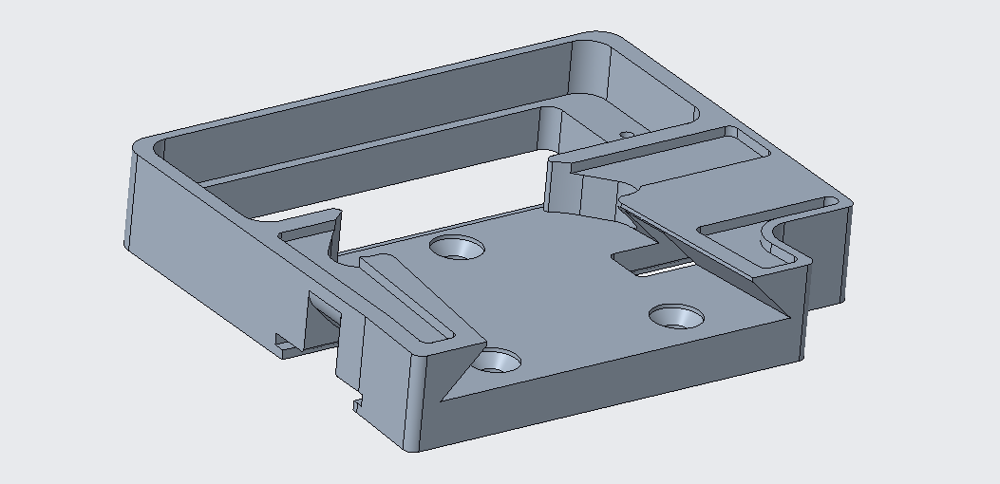
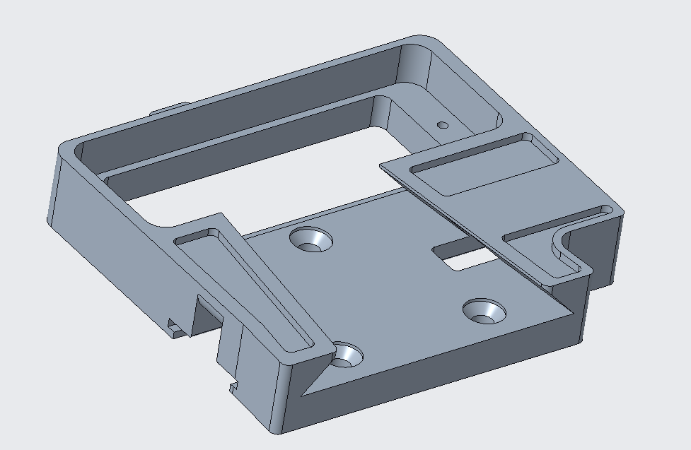

# sUPI — Change Log

**Small Universal Payload Interface**

> **DISTRIBUTION STATEMENT A. APPROVED FOR PUBLIC RELEASE; DISTRIBUTION IS UNLIMITED.**

Design change history for the sUPI mechanical interface.

> **Scope.** This log covers the **mechanical** interface only. For electrical revision state, use
> each board's `A.n` assembly revision and the revision block on its fabrication drawing. The v3.3
> electrical release adds the Medium R2 payload card and re-releases all three cards with updated
> component sourcing.

---

## sUPI 3.1

| Part | Change |
| --- | --- |
| — | Initial DEVCOM AC baseline release. |

---

## sUPI 3.2

| Part | Change |
| --- | --- |
| `19200_13122514.prt` — V-Mount Base | Changed to be machinable without custom dovetail cutter. |

<table>
<tr><td align="center"><strong>Old</strong></td><td align="center"><strong>New</strong></td></tr>
<tr>
<td></td>
<td></td>
</tr>
</table>

**`13122514` before and after the v3.2 change.**

---

## sUPI 3.3

Manufacturability and fit. Removes special tooling from the machining plan and takes slop out of the
mating stack. **No electrical interface changes.**

| Part | Change |
| --- | --- |
| `13122514` — V-Mount Base | Offset taper faces to eliminate play between parts. |
| `13122514` — V-Mount Base | Changed button cover slot to rounded interior to make it machinable. |
| `13122516` — Small Button Cover | Rounded button cover to match `13122514` slot round. |
| `13122515` — Short Button | Changed button geometry to make lower profile and eliminate bending. |
| `13122515` — Short Button | Changed button interfaces to eliminate play between parts. |
| Payload and platform interfaces | Added version number engraving. |

The engraving means **v3.3 hardware is physically marked.** Check the engraved version number
before mating mixed-vintage halves — earlier parts have looser fit, and earlier `13122515` buttons
have the taller profile that was prone to bending.
