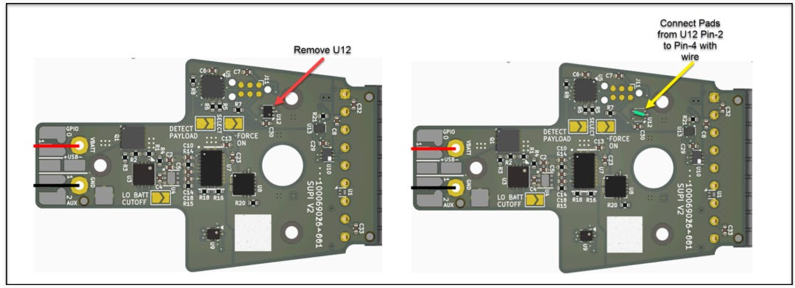
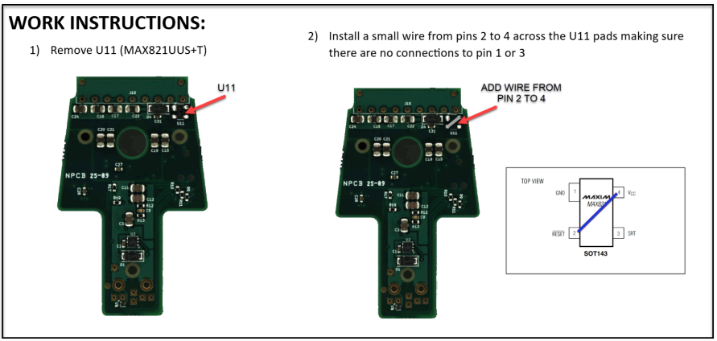

# sUPI Electrical Interfaces — Platform Rework

**DEPARTMENT OF THE ARMY**
U.S. Army Combat Capabilities Development Command, Armaments Center
Picatinny Arsenal, New Jersey 07806-5000

| | |
| --- | --- |
| **Office Symbol** | FCDD-ACE-P |
| **Date** | 30 March 2026 |
| **Subject** | sUPI Electrical Interfaces Platform Rework |
| **Applies to** | Platform card `PB-F-0210` (assembly `100064667`) |

> **DISTRIBUTION STATEMENT A. APPROVED FOR PUBLIC RELEASE; DISTRIBUTION IS UNLIMITED.**

---

## Problem

During platform testing, current draw and voltage drops during certain high-demand maneuvers
resulted in intermittent issues with some of the logic gates on the platform board.

## Direction

The short-term workaround is to remove `U12` and `U11` from the platform board **and bridge across
each footprint**, so the removed device is bypassed rather than left open.

> **The memo body calls this a "do not populate." The work instructions require a jumper in both
> positions.** Follow the work instructions.

| Reference | Device | Function | Action |
| --- | --- | --- | --- |
| `U12` | SN74LVC1G08DRLR | Single AND gate, low-voltage CMOS | Remove; wire pin 2 to pin 4 |
| `U11` | MAX821UUS+T | Supply supervisor, 2.78 V, SOT143-4 | Remove; wire pin 2 to pin 4, no connection to pin 1 or 3 |

---

### `U12` Rework

1. Remove `U12`.
2. Connect the pads from `U12` pin 2 to pin 4 with wire.

### `U11` Rework

1. Remove `U11` (MAX821UUS+T).
2. Install a small wire from pins 2 to 4 across the `U11` pads, clear of pins 1 and 3.

> **The boards photographed above are silkscreened `SUPI V2`.** Verify designator locations against
> the v3.3 fabrication drawing before reworking current hardware.

---

## Combined Effect

Applied together with the do-not-populate direction, the platform board ships without **both** its
undervoltage supervisor (`U3`) and its supply supervisor (`U11`), and with its detect/enable AND
gate (`U12`) bypassed to a permanent pass-through. Provide brownout protection and supply
supervision in platform avionics if the application requires them.

---

**Respectfully submitted,**

Robert Barone Jr, PMP \
Special Project APO \
U.S. Army Combat Capabilities Development Command, Armaments Center \
Picatinny Arsenal, NJ 07806 \
W: 520-684-1640 \
