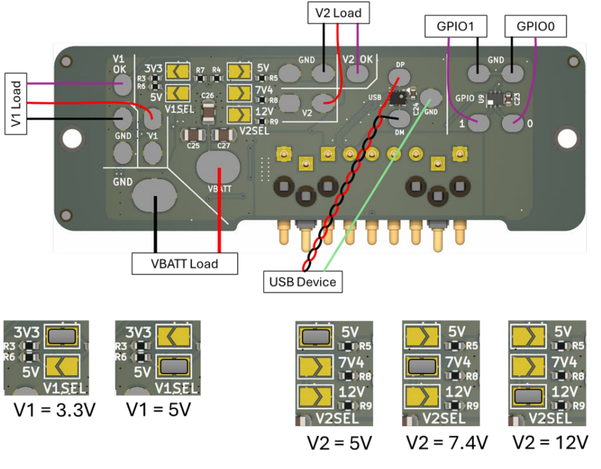
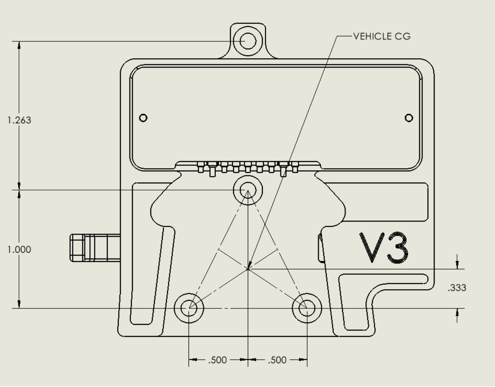

# Small Universal Payload Interface (sUPI) — Payload Side Brief

**sUPI v3.3**

> **DISTRIBUTION STATEMENT A. APPROVED FOR PUBLIC RELEASE; DISTRIBUTION IS UNLIMITED.**

---

## Overview

The sUPI interface provides an interchangeable interface to connect payloads to UxS platforms such
as drones. The interface is a subset of the Picatinny Common Lethality Interface Kit (CLIK) Design
Standard. The interface supports a detect mechanism in which the payload signals are controlled by
the platform's interface board. The payload interface board provides power to the payload and
connectivity for USB and GPIOs passed through the physical / electrical interface.

---

## Electrical Interface for Payload

The sUPI payload side electronics board has solder pads for connecting wires to the payload
interfaces. Connections should be made with 18–22 AWG wire for power (`VBATT`, `VBATT_RET`) and
24–30 AWG for signals, as indicated in the wiring diagram (Figure 1).

The payload board will provide regulated power based upon solder bridge placement over the `V1SEL`
and `V2SEL` selections.

| Signal | Range |
| --- | --- |
| `VBATT` | Platform battery, 13 to 25.2 VDC |
| `VBATT_RET` | Battery return |
| `V1` | Regulated power, 3.3 or 5 VDC |
| `V2` | Regulated power, 5, 7.4 or 12 VDC |
| `GPIO` | Typically PWM, ±5 VDC |
| `USB` | 0 to 3.3 VDC |

### Rail Selection

`V1` and `V2` are set by solder bridge at build time; there is no runtime negotiation. Verify the
bridges match the payload's requirements before first power-on.

| Selector | Options |
| --- | --- |
| `V1SEL` | `3V3` or `5V` |
| `V2SEL` | `5V`, `7V4` (7.4 V), or `12V` |

### Solder Pads

The payload board silkscreen labels its wiring pads directly: `VBATT`, `GND`, `V1`, `V1 OK`, `V2`,
`V2 OK`, `USB DP`, `USB DM`, `GPIO 0`, `GPIO 1`.

**Figure 1.** Payload side wiring diagram and rail selection. Lower panels show the valid `V1SEL`
and `V2SEL` solder bridge placements.

---

## Mechanical Interface for Payload

The sUPI Payload Side is intended to be mounted to a payload via **4X M3 × 0.5 mm thread, 8 mm
long, black-oxide stainless steel Phillips flat head screws** (e.g. McMaster PN 91698A304). The
mounting hole pattern is shown in Figure 2.

Existing payloads should be modified in one of the following ways to install a sUPI Payload Side
interface:

- **Drill and tap 4X holes** into the payload as shown in Figure 2, in the desired location for
  mounting the sUPI payload side. For a UAV platform, it is recommended that the vehicle CG align as
  closely as possible with the point indicated in Figure 2.
- **Create a custom adapter** that includes the sUPI Payload Side hole pattern and enables mounting
  to an existing mounting interface on a payload.

**Figure 2.** Payload side mounting hole pattern — 4X M3, viewed from the mounting face. Dimensions
in inches. The `VEHICLE CG` callout marks the recommended center-of-gravity reference point. The two
smaller holes are M2 board-mounting features, not host mounting points.

Refer to drawing `19200_13122514` for controlling dimensions and tolerances.
