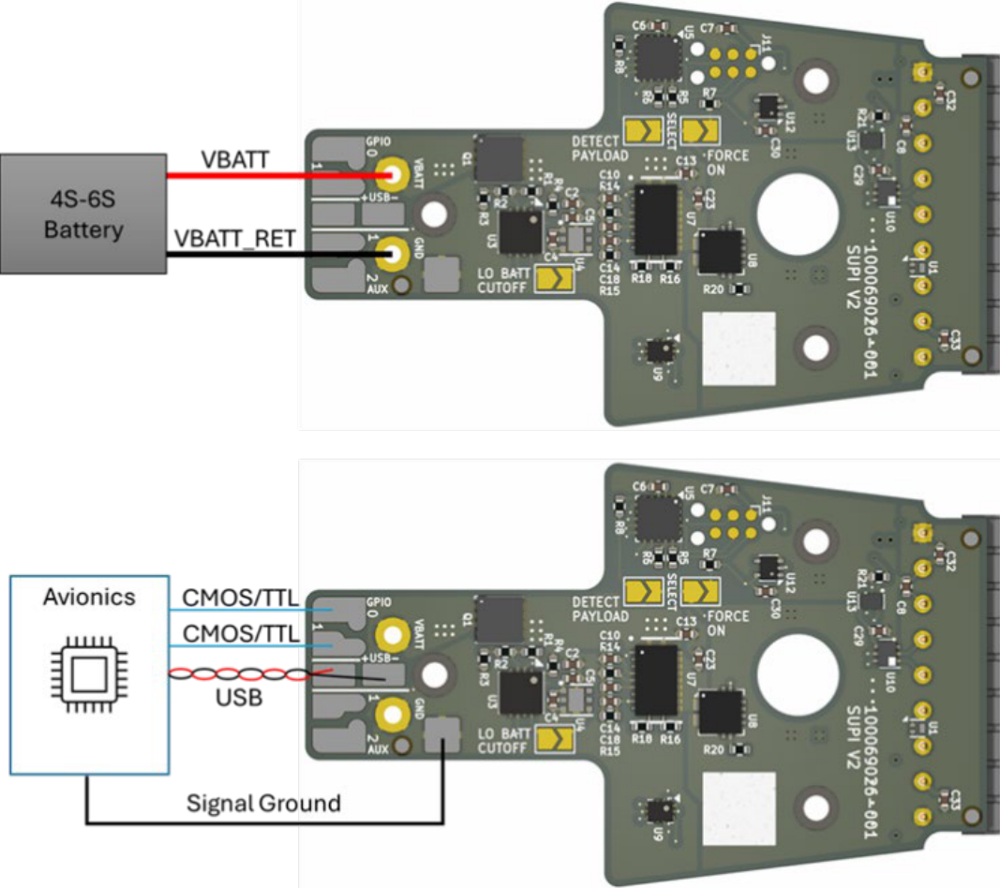
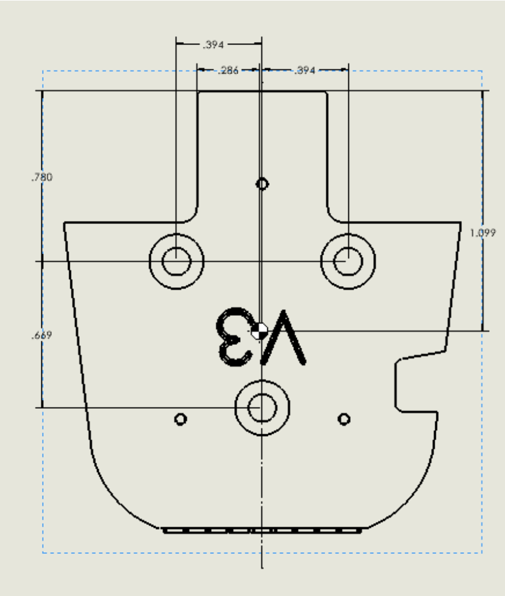

# Small Universal Payload Interface (sUPI) — Platform Side Brief

**sUPI v3.3**

> **DISTRIBUTION STATEMENT A. APPROVED FOR PUBLIC RELEASE; DISTRIBUTION IS UNLIMITED.**

---

## Overview

The sUPI interface provides an interchangeable interface to connect payloads to UxS platforms such
as drones. The interface is a subset of the Picatinny Common Lethality Interface Kit (CLIK) Design
Standard. The interface supports a detect mechanism in which the payload signals are controlled by
the platform's interface board. The payload interface board provides power to the payload and
connectivity for USB and GPIOs passed through the physical / electrical interface.

---

## Electrical Interface for Platform

The sUPI platform side electronics board has solder pads for connecting wires to platform avionics.
Connections should be made with 18–22 AWG wire for power (`VBATT`, `VBATT_RET`) and 24–30 AWG for
signals, as indicated in the wiring diagram (Figure 1).

The platform will need to provide the following to the sUPI interface board:

| Signal | Range |
| --- | --- |
| `VBATT` | Platform battery, 13 to 25.2 VDC |
| `VBATT_RET` | Battery return |
| `GPIO` | Typically PWM, ±5 VDC |
| `USB` | 0 to 3.3 VDC |

The 13 to 25.2 VDC range corresponds to a 4S–6S lithium-polymer pack.

### Solder Pads and Jumpers

The platform board silkscreen labels its wiring pads and configuration jumpers directly:

- **Wiring pads:** `VBATT`, `GND`, `GPIO 0`, `GPIO 1`, `+USB−`, `AUX`
- **Configuration jumpers:** `DETECT PAYLOAD`, `SELECT`, `FORCE ON`, `LO BATT CUTOFF`

**Figure 1.** Platform side wiring diagram. Battery to `VBATT` / `GND`; avionics to `GPIO`, `+USB−`,
and ground.

---

## Mechanical Interface for Platform

The sUPI Platform Side is intended to be mounted to a platform via **3X M3 × 0.5 mm thread, 8 mm
long, black-oxide stainless steel Phillips flat head screws** (e.g. McMaster PN 91698A304). The
mounting hole pattern is shown in Figure 2.

Platforms should be modified in one of the following ways to install a sUPI Platform Side
interface:

- **Drill and tap 3X holes** into the platform as shown in Figure 2, in the desired location for
  mounting the sUPI Platform Side.
- **Create a custom adapter** that includes the sUPI platform side hole pattern and enables mounting
  to an existing mounting interface on a platform.

**Figure 2.** Platform side mounting hole pattern — 3X M3, viewed from the mounting face.
Dimensions in inches. The three smaller holes are M1.6 board-mounting features, not host mounting
points.

Refer to drawing `19200_13122518` for controlling dimensions and tolerances.
